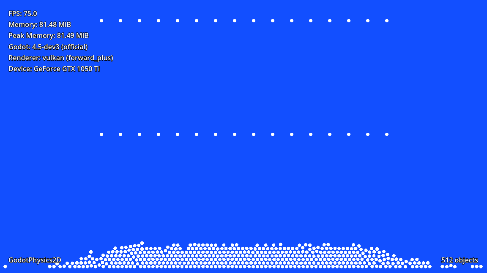
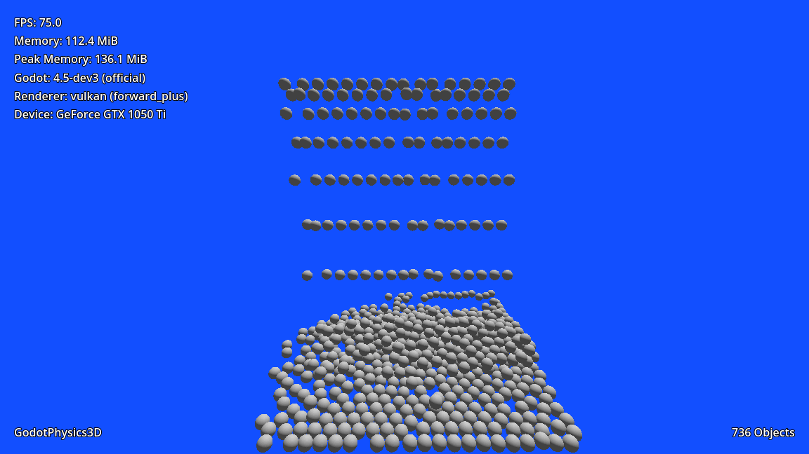
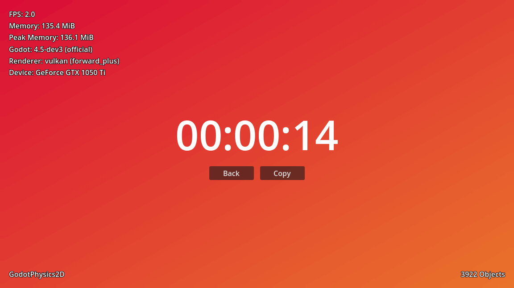

<p align="center">
	
</p>

<p align="center">
	<a href="https://www.youtube.com/watch?v=NCljuMv1Vdc">
		
	</a>
	<a href="https://www.reddit.com/r/brgodot/">
		
	</a>
</p>

## About this project

This is a minimalist project with the purpose of performing very simple, quick and easy tests. Its goal is not to be technical or advanced and for now the tests are focused on the systems:

- GodotPhysic2D
- GodotPhysic3D
- Jolt Physics (3D)

## Exporting

By default the project is pre-configured to export to the following platforms:

- Windows
- macOS
- Linux
- Android
- iOS
- Web

To export, open the project and go to `Project` > `Export...`, then select the platform.

## Configuration

After exporting the project to the platform you want, you can add a file called `override.cfg` to the generated application (not all platforms will support this), which will allow you to change the systems:

- Physics engine
- Thread behavior
- Rendering driver (Vulkan or D3D12)
- Rendering method (`forward_plus`, `mobile`, `gl_compatibility`)

Default:

```
[physics]

2d/run_on_separate_thread=false
3d/run_on_separate_thread=false
2d/physics_engine="GodotPhysics2D"
3d/physics_engine="GodotPhysics3D"

[rendering]

rendering_device/driver.windows="vulkan"
renderer/rendering_method="forward_plus"
```

Run physics on separated thread:

```
[physics]

2d/run_on_separate_thread=true
3d/run_on_separate_thread=true
2d/physics_engine="GodotPhysics2D"
3d/physics_engine="GodotPhysics3D"

[rendering]

rendering_device/driver.windows="vulkan"
renderer/rendering_method="forward_plus"
```
Run with Jolt physics for 3D:

```
[physics]

2d/run_on_separate_thread=false
3d/run_on_separate_thread=false
2d/physics_engine="GodotPhysics2D"
3d/physics_engine="Jolt Physics"

[rendering]

rendering_device/driver.windows="vulkan"
renderer/rendering_method="forward_plus"
```
Run with Direct3D 12:

```
[physics]

2d/run_on_separate_thread=false
3d/run_on_separate_thread=false
2d/physics_engine="GodotPhysics2D"
3d/physics_engine="GodotPhysics3D"

[rendering]

rendering_device/driver.windows="d3d12"
renderer/rendering_method="forward_plus"
```
Using GL Compatibility:

```
[physics]

2d/run_on_separate_thread=false
3d/run_on_separate_thread=false
2d/physics_engine="GodotPhysics2D"
3d/physics_engine="GodotPhysics3D"

[rendering]

rendering_device/driver.windows="vulkan"
renderer/rendering_method="gl_compatibility"
```

## Samples

2D physics | 3D physics  | Result
---| --- | ---
<a href="art/2D-godot-physics-sample.png"></a> | <a href="art/3D-godot-physics-sample.png"></a> | <a href="art/results-sample.png"></a>